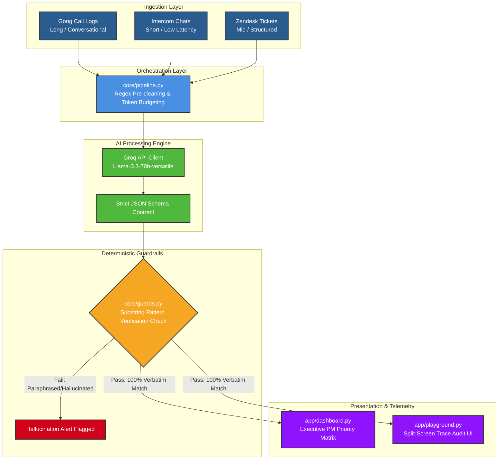

# 📊 VoxInsight: The Self-Healing Voice of Customer (VoC) Pipeline

VoxInsight is an enterprise-tier data processing and telemetry engine designed to transform chaotic, unstructured customer interactions (Gong calls, Zendesk support tickets, Intercom chats) into clean, structured, and quantifiable feature development priorities. 

By leveraging ultra-low latency infrastructure via **Groq (Llama-3.3)** and combining it with deterministic Python validation layers, VoxInsight eliminates the core failure modes of LLMs—hallucinations and high API latency—to deliver product insights that engineering teams can instantly trust.

Live Application Link: **https://voc-insight.streamlit.app/**

---

## 🏗️ System Architecture

The core engineering strategy decouples the data ingestion, AI processing, and validation rules to guarantee system uptime, cost management, and perfect data traceability.



### Architectural Pipeline Breakdown
* **Data Stream Ingestion Layer:** Routes structured ticket materials and noisy conversation streams through unified text entry routes.
* **Orchestration Layer (`core/pipeline.py`):** Strips system artifacts, repetitive signatures, and conversational fluff to optimize data sizes, preventing budget overruns or token context crashes.
* **Groq Processing Engine:** Distributes text packages to the high-speed Groq platform at `temperature=0.0` within a structural JSON mode layout.
* **Deterministic Guardrails (`core/guards.py`):** Verifies the AI's data extractions against the source text. If a quote doesn't match verbatim, it throws a flag to preserve data trustworthiness.
* **Telemetry Interfaces (`app/`):** Hosts an analytical dashboard with dynamic issue tracking alerts and a split-screen playground for deep-dive conversation tracking.

---

## 🌟 Core System Capabilities

### 1. Lightning-Fast Analysis (Powered by Groq)
By migrating from legacy models to the **Groq Llama-3.3-70b-versatile** engine, text extraction delays drop from several seconds down to **200–400 milliseconds**. This makes it viable for high-volume enterprise production processing.

### 2. Anti-Hallucination Data Guardrails
AI metrics are useless if the underlying data can't be trusted. VoxInsight solves this by running a deterministic string verification check on the extracted customer text. If the AI "paraphrases" or creates a quote, the platform flags the entry to keep the database accurate.

### 3. Dynamic Anomaly Alert Signals
The analytics engine features an automated **Trend Anomaly Watchdog**. It calculates shifting averages over a 90-day rolling timeline. If customer sentiment drops heavily within a specific feature module, an executive-level system alert is instantly generated.

---

## 🛠️ Technology Stack & Dependencies

* **Frontend Dashboard UI:** Streamlit (Multi-page configuration routing)
* **High-Speed Inference Network:** Groq SDK (`llama-3.3-70b-versatile`)
* **Strict Structural Protocols:** Python `Enum` & custom schema JSON mapping contracts
* **Data Presentation Engine:** Pandas & Plotly (Rolling sentiment trajectories)
* **Pipeline Defensiveness:** Tenacity (Exponential wait/retry backoff loop handlers)

---

## 📂 Repository Directory Layout

```text
voxinsight-pipeline/
│
├── .streamlit/
│   └── secrets.toml          # Production environment token storage (Excluded via .gitignore)
│
├── app/
│   ├── main.py               # Application router & layout configuration
│   ├── dashboard.py          # Tab 1: Executive Analytics Dashboard & Telemetry
│   ├── playground.py         # Tab 2: Live AI Playground & Split-Screen Trace Audit
│   └── strategy_page.py      # Tab 3: Technical Implementation Strategy Brief
│
├── core/
│   ├── __init__.py
│   ├── pipeline.py           # Core Groq processing engine & extraction configuration
│   └── guards.py             # Deterministic verification & anti-hallucination guardrails
│
├── data/
│   └── mock_historical.csv   # Synthesized 90-day telemetry dataset (Includes built-in anomalies)
│
├── scripts/
│   └── generate_mock_data.py # Automated historical data synthesis generation script
│
├── .gitignore                # System-level version control exception file
└── requirements.txt          # Explicitly pinned production dependencies
```

---

## 🚀 Local Deployment Setup

Follow these commands to clone, initialize, and execute the system environment locally:

```bash
# 1. Clone your project repository
git clone https://github.com/YOUR_GITHUB_USERNAME/voxinsight-pipeline.git
cd voxinsight-pipeline

# 2. Build local virtual environment isolation layers using uv
uv venv
.venv\Scripts\Activate.ps1  # For Windows users
source .venv/bin/activate   # For Mac/Linux users

# 3. Install fully pinned production package dependencies
uv pip install -r requirements.txt

# 4. Generate the 90-day anomaly database file
python scripts/generate_mock_data.py

# 5. Fire up the local web engine server
uv run streamlit run app/main.py
```

---

## 📑 Strategic Business Context

VoxInsight was engineered to map directly to standard software delivery workflows:
* **Short-Form Content (Intercom Chat):** Low processing cost, high immediacy. Instantly tracks immediate operational roadblocks and breaking UI bugs.
* **Medium-Form Content (Zendesk Support):** High structural density. Optimizes resources by routing directly into categorized support metrics.
* **Long-Form Content (Gong Call Logs):** High conversation noise. Strips out introductory chatter and scheduling text to keep processing costs low and prevent context errors.
